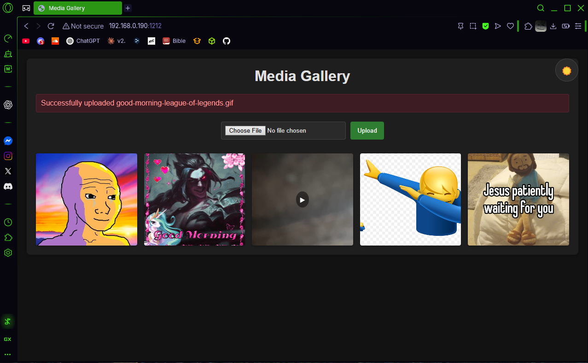

# LocalCloud? *Why??**
I wanted to transfer my images and videos between phones and PCs/laptops at home without losing quality or being limited by file size. I saw an opportunity to build a solution that allows unlimited transfers, with virtually no limit on cloud storage size (GB/TB) — the only limit is the storage capacity of the server hosting the application. Best of all, it's completely free and runs locally.

## Features

- Upload images (PNG, JPG, JPEG, GIF)  &  videos (MP4, MOV, AVI, WEBM)
- Dark/light theme toggle  
- Click thumbnails to preview, navigate, or download

