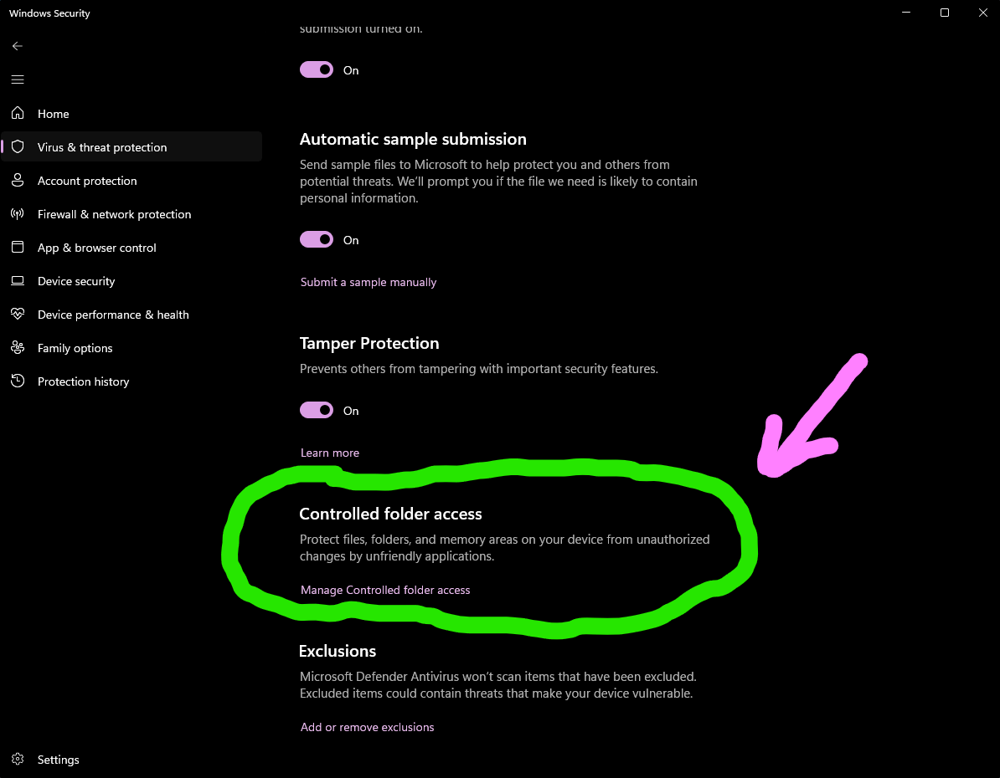

# Windows-Specific Troubleshooting

## Windows Defender/Antivirus

- Your antivirus might flag the Python server
- Add an exception for your project folder if needed

Set it up from here:


## Port Issues

If port 1212 is in use, you can change it in `app.py` on this line:

```python
app.run(host='0.0.0.0', port=8080, debug=True, threaded=True)  # Use port 8080 instead, or any port you like
```

## Permission Errors

- Run Command Prompt as Administrator
- Or use PowerShell with execution policy change:
  ```powershell
  Set-ExecutionPolicy -ExecutionPolicy RemoteSigned -Scope CurrentUser
  ```
